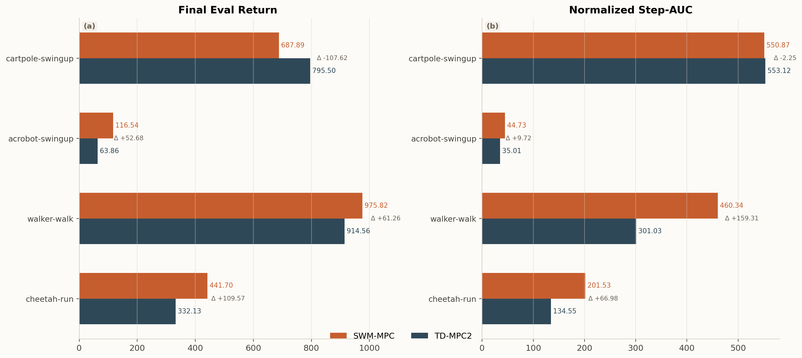

# 新疆大学本科毕业论文（设计）Markdown 示例

## 封面信息

论文题目：新疆大学本科毕业论文 Markdown 转 Word 示例

学生姓名：张三

学号：20220801234

所属院系：数学与系统科学学院

专业：数学与应用数学

班级：应数22-1班

指导教师：李四

日期：2026 年 4 月

---

## 声明

本人郑重声明：本示例文档仅用于演示新疆大学本科毕业论文 Markdown 到 Word 的导出流程，不作为真实论文提交材料。

作者签名：__________

签字日期：__________

---

## 任务书

届：2026

工作开始日期：2026 年 3 月 1 日

工作结束日期：2026 年 5 月 20 日

目的及意义：围绕新疆大学本科毕业论文 Markdown 写作与 Word 原生导出场景，验证主稿结构化维护、版式自动生成和 PDF 预览检查的完整流程，为后续论文写作工具化提供可复用示例。

主要工作任务：梳理学校本科毕业论文格式要求，设计 Markdown 前置区和正文结构；实现原生 OOXML 导出、公式转换、图表插入、目录域和页码节设置；生成示例论文并通过 Word PDF 预览检查版式。

教研室主任：

接受任务日期：

---

## 摘要

本文围绕新疆大学本科毕业论文写作场景，给出一个基于 Markdown 主稿与原生 OOXML 生成的示例工作流。该流程以结构化文本作为长期维护载体，通过样式生成、公式转换、图表插入、目录域写入和参考文献链接等机制，形成一条适合多轮修改与反复导出的论文排版路径。为便于使用者快速上手，本文示例进一步展示了标题层级、单图、并排图、表格、行内公式、块公式、公式编号、引用块、代码块、参考文献和附录等常见论文元素在该工具中的写法。

从示例内容可以看出，将论文主稿维护在 Markdown 中，有助于把“内容修改”与“提交格式”分离：前者主要关注章节组织、论证与实验结果；后者则集中在原生样式生成、目录刷新、分页检查和最终审阅。对于需要反复修改的毕业论文而言，这种方式可以显著减少重复排版劳动，并提高文稿版本管理效率。

关键词：Markdown；Word；毕业论文；OOXML；自动化

---

## ABSTRACT

This document presents a Markdown-to-Word workflow for Xinjiang University undergraduate theses. The core idea is to keep the thesis source in Markdown, generate an OOXML DOCX package, and produce a reviewable Word document with a cover page, table of contents, figures, tables, references, and appendices. To make the workflow easier to understand, this sample thesis explicitly demonstrates heading hierarchies, single figures, side-by-side figures, tables, inline equations, numbered display equations, block quotes, code blocks, references, and appendices.

The example also highlights a practical separation of concerns. Markdown is used to maintain the evolving academic content, while Word is reserved for final formatting inspection, advisor review, and submission-oriented polishing. For undergraduate theses that often require repeated revisions, this separation can reduce redundant typesetting work and improve document version management.

KEY WORDS: Markdown; Word; Native OOXML; Format automation; Document workflow

---

## 目录

1 绪论

2 Markdown 论文写作表达示例

3 导出器设计与实现示例

4 结果展示与版式分析

5 结论

参考文献

致谢

附录

---

# 1 绪论

## 1.1 研究背景

毕业论文在撰写后期通常会经历多轮结构性修改。若全文直接维护在 Word 中，章节调整、目录刷新、图表移动、批量替换和版本对比会逐步变得低效。将主稿长期维护在 Markdown 中，则更适合配合版本控制、文本差异比较和结构性重写[1-2]。

若将第 $k$ 次修订后的文稿记为 $\mathbf{x}^{(k)}$，则版本差异可以粗略写成 $\Delta_k=\|\mathbf{x}^{(k)}-\mathbf{x}^{(k-1)}\|_0$，而由版式调整带来的扰动可抽象为 $r_k=\|T(\mathbf{x}^{(k)})-T(\mathbf{x}^{(k-1)})\|_1$。这类写法虽然只是示意，但很适合在论文中穿插展示范数、算子和下标等行内公式能力。

### 1.1.1 论文版式约束

三级标题用于呈现小节内部的进一步划分。按照学校格式要求，三级标题采用四号宋体，左起空两字符，段前空半行，段后不另加空行；正文仍回到小四号宋体、首行缩进两字符和 1.5 倍行距。

对于一套论文导出工具而言，目标并不是完全取代 Word，而是在“内容维护”与“最终提交格式”之间建立清晰分工。若以“文稿维护成本”作为抽象目标，则其优化方向可以写成：

$$
\min_{\mathcal{W}} \ \mathcal{L}_{draft} + \lambda \mathcal{L}_{format},
$$

若把每轮修改视为一次迭代，则还可以写成：

$$
\mathbf{x}_{k+1}=\mathbf{x}_k-\eta \nabla J(\mathbf{x}_k),\qquad
J(\mathbf{x})=\mathcal{L}_{draft}(\mathbf{x})+\lambda \mathcal{L}_{format}(\mathbf{x})+\mu \sum_{k=1}^{n} r_k.
$$

其中，$\mathcal{L}_{draft}$ 表示正文修改和版本维护成本，$\mathcal{L}_{format}$ 表示格式调整与交叉检查成本，$\lambda$ 与 $\mu$ 为两类成本之间的权衡系数。对于大多数本科论文而言，希望降低的并不是“最终人工检查”本身，而是前期和中期反复排版带来的重复劳动。

## 1.2 研究目标与评价视角

本示例并不研究新的自然语言处理算法，而是围绕毕业论文工作流本身给出一个可复用的写作与导出方案。其目标主要有三个方面。

第一，保证论文主稿能够以结构化文本的方式持续维护。第二，保证生成的 Word 文档由稳定、可追踪的 OOXML 部件组成，并尽量贴近学校论文格式。第三，保证图片、表格、目录和参考文献等常见元素能够在一次导出后形成可继续人工验收的中间结果[3-4]。

为说明这个流程的评价角度，本文采用三个简单指标：

表 1-1 示例评价指标

| 指标 | 含义 | 观察方式 |
| --- | --- | --- |
| 内容维护效率 | 是否便于重写和批量修改 | 比较 Markdown 与直接改 Word 的修改过程 |
| 版式生成能力 | 是否稳定生成论文样式与节结构 | 观察导出后目录、段落和页码区域 |
| 最终可交付性 | 是否便于导师审阅和提交前检查 | 打开 Word / WPS 进行人工验收 |

若进一步把三个指标综合成单一得分，也可以写成

$$
S=\alpha E_{edit}+\beta E_{style}+\gamma E_{delivery},\qquad
\alpha+\beta+\gamma=1,\quad \alpha,\beta,\gamma\in[0,1].
$$

这种线性加权形式并不复杂，却足以体现分数、下标、约束条件和区间记号在 Word 公式中的呈现效果。

## 1.3 本文结构安排

本文余下内容安排如下。第二章重点展示 Markdown 在论文场景下的表达方式，包括公式、表格、单图、并排图、引用块和代码块。第三章给出导出器的逻辑结构与工作流设计。第四章展示示例结果，并从图表排版与引用效果角度分析导出结果。第五章给出结论与使用建议。

# 2 Markdown 论文写作表达示例

## 2.1 行内公式与块公式

在论文正文中，行内公式适合表达紧凑的概念，例如目标函数 $J(\theta)$、折扣因子 $\gamma$、状态变量 $z_t$、向量范数 $\|x\|_2$、期望 $\mathbb{E}[X]$、方差 $\mathrm{Var}(X)$、梯度 $\nabla f(x)$、Hessian 矩阵 $\nabla^2 f(x)$ 与拉普拉斯算子 $\Delta u=\nabla\cdot\nabla u$。当公式较长时，宜使用块公式以提高可读性；导出时，正文中的块公式会按当前章节自动追加编号。以强化学习中的 Bellman 递推为例，可写为：

$$
Q^\pi(s_t,a_t)=r_t+\gamma\mathbb{E}_{s_{t+1},a_{t+1}\sim\pi}\left[Q^\pi(s_{t+1},a_{t+1})\right].
$$

若进一步定义一条长度为 $T$ 的评估曲线 $\{y_t\}_{t=1}^T$，则其归一化面积可写为：

$$
\operatorname{AUC}=\frac{1}{T}\sum_{t=1}^{T} y_t.
$$

如果需要展示经典数学内容，则还可以在同一篇论文中自然地穿插微积分、向量分析和不等式等公式。例如，微积分基本定理可以写为

$$
\int_a^b f'(x)\,\mathrm{d}x=f(b)-f(a),\qquad
\frac{\mathrm{d}}{\mathrm{d}x}\int_a^x f(t)\,\mathrm{d}t=f(x).
$$

若要描述局部逼近，则一元函数在 $x_0$ 附近的 Taylor 展开可写为

$$
f(x)=f(x_0)+f'(x_0)(x-x_0)+\frac{f''(\xi)}{2}(x-x_0)^2,\qquad \xi\in(x_0,x).
$$

对于向量与序列，不等式写法同样常见。例如 Cauchy-Schwarz 不等式为

$$
\left(\sum_{i=1}^{n} a_i b_i\right)^2 \le \left(\sum_{i=1}^{n} a_i^2\right)\left(\sum_{i=1}^{n} b_i^2\right),
\qquad
\left|\langle x,y\rangle\right| \le \|x\|_2 \|y\|_2.
$$

再进一步，若记平面区域为 $D$、空间区域为 $\Omega$、曲面为 $\Sigma$、向量场为 $\mathbf{F}$，则 Green 公式、Gauss 散度定理和 Stokes 公式分别可写为

$$
\oint_{\partial D}\left(P\,\mathrm{d}x+Q\,\mathrm{d}y\right)
=\iint_D\left(\frac{\partial Q}{\partial x}-\frac{\partial P}{\partial y}\right)\,\mathrm{d}A,
$$

$$
\iiint_{\Omega}\nabla\cdot\mathbf{F}\,\mathrm{d}V
=\iint_{\partial\Omega}\mathbf{F}\cdot\mathbf{n}\,\mathrm{d}S,
$$

$$
\iint_{\Sigma}\left(\nabla\times\mathbf{F}\right)\cdot\mathbf{n}\,\mathrm{d}S
=\oint_{\partial\Sigma}\mathbf{F}\cdot\mathrm{d}\mathbf{r}.
$$

这些公式在导出时若成功转换为 Word 原生公式，会比直接保留 LaTeX 字符串更适合审阅与打印，也更能体现该工具对积分号、分式、上下限、粗体向量与微分算子的支持效果。

## 2.2 表格表达示例

除公式外，表格也是本科论文中非常高频的元素。下表给出本工具支持的常见论文元素：

表 2-1 工具支持的常见论文元素

| 能力 | 示例 | 说明 |
| --- | --- | --- |
| 一级到三级标题 | `#` / `##` / `###` | 控制目录层级 |
| 单图 | `` | 图与图题分开写更稳 |
| 并排图 | `:::figure-row` | 适合两图横向对比 |
| 行内公式 | `$J(\theta)$` | 适合短公式 |
| 块公式 | `$$ ... $$` | 适合长公式 |
| 参考文献 | `[1]` | 可生成正文到文末的跳转 |

写表格时应优先控制源文的信息密度。导出器会自动估算列宽和字号，但如果表头或第一列写得过长，最终仍可能出现换行；这类解释性内容更适合放在表题后的正文中，而不是放进单元格。

再例如，若需要汇总不同写作方式的优缺点，也可使用更偏“分析表”的写法：

表 2-2 常见写作载体对比

| 写作载体 | 优点 | 局限 |
| --- | --- | --- |
| 纯 Word | 上手直接、编辑所见即所得 | 多轮结构性修改成本较高 |
| 纯 Markdown | 适合版本管理与批量修改 | 最终提交格式需额外处理 |
| Markdown + 原生 DOCX 导出 | 兼顾结构维护与最终交付 | 仍需最终人工验收 |

## 2.3 单图写法

单图适合展示一个独立结果或总览图。下面给出一个单图示例。



图 2-1 最终回报与 step-AUC 汇总示例

图 2-1 更适合用来展示最终回报或聚合指标，因为单张图不会分散读者注意力，适合在章节中作为核心结果图进行说明。

## 2.4 并排图写法

如果需要强调两种结果之间的对比关系，则并排图更合适。下面展示一组并排图。

:::figure-row


:::

图 2-2 并排图写法示例

并排图有两个好处。第一，可以把“结果汇总图”和“过程曲线图”放在同一视觉区域内，便于横向比较。第二，当两幅图高度统一时，整体版式更规整，适合论文正文中的方法对比或实验分析场景。

## 2.5 行内引用与交叉说明

在论文正文中，公式和引用往往会同时出现。例如，当讨论“世界模型”方法的样本效率时，可以同时引用 DreamerV3 和相关的 Markdown 语法说明文档[1-2]。若进一步涉及模型预测控制、文档格式表达和 OOXML 结构，也可以继续引用更偏工程实践的资料[3-6]。类似地，也可以写成“当误差满足 $\varepsilon_n\to 0$ 且整体复杂度仍保持在 $O(n\log n)$ 时，导出链路在多轮修改后依然具备较好的可维护性[1，3-4]”，从而同时覆盖行内公式与交叉引用。

中文参考文献条目应使用中文全角标点，正文同一处引用多个文献时也建议使用全角逗号，例如[2，7]。英文参考文献则使用英文半角标点，`[EB/OL]` 条目建议写明访问日期和 URL。

这一点说明：对于论文示例而言，最重要的不是“引用数量很多”，而是引用在结构上保持统一，并能在导出后形成可点击的文末跳转。

## 2.6 引用块与代码块

论文正文一般不宜堆放大量代码，但在方法说明、算法伪代码或附录材料中，短代码块仍然很常见。导出器会把 fenced code block 作为独立代码段处理，并尽量避免它进入目录。

> 这是一段引用块示例。它适合放置重要定义、材料来源说明或需要与正文区分的短提示，不建议承载过长的论证内容。

下面给出一个极简伪代码示例，用来说明代码块的写法。

```python
def export_once(markdown_path, output_path):
    document = parse_markdown(markdown_path)
    docx = render_ooxml_docx(document)
    docx.save(output_path)
```

实际论文中，如果代码较长，建议放入附录，并在正文中只保留关键逻辑说明。

# 3 导出器设计与实现示例

## 3.1 总体流程

本工具的导出流程可以简要概括为“解析主稿、生成样式、处理资源、写入文档包”四步：

$$
\text{Markdown Source} \rightarrow \text{Parser} \rightarrow \text{OOXML Renderer} \rightarrow \text{DOCX Output}.
$$

若把导出器抽象成一个映射 $\Phi$，则还可以进一步记为

$$
(\mathcal{C},\mathcal{R},\mathcal{A})=\Phi(\mathcal{D}),\qquad
\Phi=\Phi_{parse}\circ\Phi_{style}\circ\Phi_{render},
$$

其中 $\mathcal{C}$ 表示章节结构，$\mathcal{R}$ 表示资源集合，$\mathcal{A}$ 表示附件与样式资产。解析器首先识别封面信息、摘要、目录和正文标题；随后导出器生成样式表、节属性、页眉页脚、关系文件和内容类型；最后再将图片、表格、公式和参考文献信息写入新的 Word 文档结构中。若仅从数量级估计，其处理开销通常可写成 $O(|\mathcal{D}|+N_{fig}+N_{tbl}+N_{eq})$。

## 3.2 文档结构解析

从实现角度看，主稿并不是任意 Markdown，而是一个适合毕业论文写作的受控子集。正文必须从编号一级标题开始，前置部分则按 `封面信息`、`声明`、`摘要`、`ABSTRACT`、`目录` 等部分组织。这样做的好处在于，导出器能够稳定地区分“封面前言部分”和“正文部分”，并在生成 Word 文档时插入不同的节和分页。

如果记主稿文本为 $\mathcal{D}$，前置部分集合为 $\mathcal{F}$，正文部分为 $\mathcal{B}$，则可以把解析过程写成：

$$
\mathcal{D}\mapsto (\mathcal{F}, \mathcal{B}).
$$

进一步地，有

$$
\mathcal{F}\cap\mathcal{B}=\varnothing,\qquad
\mathcal{F}\cup\mathcal{B}=\mathcal{D},
$$

并可通过层级函数 $h:\mathcal{B}\to\{1,2,3\}$ 为标题节点分配目录级别。这样的抽象虽然简单，却足以支撑大多数本科论文场景。

## 3.3 图表与公式资源处理

图表和公式是最容易在导出链路中出问题的两类元素。图片需要同时处理路径、尺寸和版式；公式则需要在“尽量转换成 Word 原生公式”和“依赖缺失时保底导出”之间取得平衡。若第 $i$ 张图片原始宽高为 $(w_i,h_i)$，允许的最大宽高为 $(w_{\max},h_{\max})$，则常用的缩放因子可写成

$$
s_i=\min\left\{\frac{w_{\max}}{w_i},\frac{h_{\max}}{h_i},1\right\},\qquad
(w_i',h_i')=s_i(w_i,h_i).
$$

当前实现中，并排图使用固定宽度表格承载，再对图片进行统一高度或统一约束范围的缩放，以保证整体观感整齐。若希望左右两图尽量规整，还可以把目标高度记为 $\hat{h}=\min\{h_{\max},\max(h_{\min},\operatorname{median}(h_1,h_2))\}$，并控制 $|h_1'-h_2'|\le \varepsilon$。公式部分则在依赖齐全时把 LaTeX 转成 OMML，依赖缺失时退化成原始文本并打印 warning，而不会阻塞整篇论文导出。这个过程可以写成

$$
\Psi(\ell)=
\begin{cases}
\operatorname{OMML}(\ell), & \text{公式依赖齐全},\\
\ell, & \text{公式依赖缺失}.
\end{cases}
$$

## 3.4 最终验收原则

即使使用自动化导出，最终仍然建议在 Word 或 WPS 中检查目录、图号、表号、分页和参考文献格式。这一步不应该被自动化省略。自动化导出的价值，在于把反复修改阶段的重复劳动尽量前移并削减，而不是取消最后的提交格式验收。

# 4 结果展示与版式分析

## 4.1 结果总览图

为了展示单图在正文中的效果，下面给出一个更偏“总览”的结果图示例。


图 4-1 评估曲线总览示例

在真实论文中，这类图通常用于展示不同方法随训练步数变化的评估趋势。与最终柱状图相比，曲线总览图更适合讨论训练过程、收敛速度和阶段性波动。

## 4.2 结果表格与描述

若把图 2-1 和图 4-1 的用途放在同一个分析框架里，则可以得到如下结果组织方式：

表 4-1 结果展示方式的适用场景

| 展示方式 | 更适合回答的问题 | 推荐放置位置 |
| --- | --- | --- |
| 最终柱状图 | 哪个方法最终更好 | 结果章节开头或总结处 |
| 曲线总览图 | 哪个方法收敛更稳、更快 | 结果分析正文 |
| 并排图 | 汇总结果与过程结果如何对应 | 需要对比说明的段落 |

如果表格在最终 PDF 中跨页，可以在表题和表格之间加入 `thesis-table-split` 标记，由导出器生成“（续）”题注并重复表头。标记中的数字按数据行计数，不包含表头行。下面给出一个短表示例，实际论文中通常用于更长的数据表。

表 4-2 续表拆分标记示例

<!-- thesis-table-split: 4 -->

| 条件 | 指标 A | 指标 B |
| --- | --- | --- |
| 设置 1 | 0.91 | 0.83 |
| 设置 2 | 0.88 | 0.81 |
| 设置 3 | 0.86 | 0.79 |
| 设置 4 | 0.85 | 0.77 |
| 设置 5 | 0.82 | 0.76 |
| 设置 6 | 0.80 | 0.73 |

表 4-2 中的 `thesis-table-split: 4` 表示第一段保留 4 行数据，其余数据自动生成续表。若需要多段续表，可以写成 `thesis-table-split: 8, 10`，表示第一段 8 行、第二段 10 行，剩余数据作为最后一段。

由此可见，图与表并不是互相替代关系，而是相互补充。图更偏向直观展示，表则更适合对比和总结。在本科论文场景中，二者往往需要同时存在。

若进一步用统计量概括多次实验结果，则均值与样本方差分别可写为

$$
\bar{y}=\frac{1}{n}\sum_{i=1}^{n} y_i,\qquad
s^2=\frac{1}{n-1}\sum_{i=1}^{n}(y_i-\bar{y})^2.
$$

相对提升幅度也常写成 $\delta=\dfrac{y_{\text{new}}-y_{\text{base}}}{|y_{\text{base}}|}$。这些表达式与图表配合使用时，往往能让结果分析更接近真实论文写作。

## 4.3 版式观感分析

从导出结果看，若单图、并排图、表格和公式都遵循统一的写法规则，则最终 Word 文档在观感上会更加稳定。尤其是并排图，若左右图片高度一致，读者会更容易把它们理解为同一组结果；若参考文献引用可以直接跳转，则审阅过程也会更顺畅。若把两张并排图的纵横比分别记为 $r_1=h_1/w_1$、$r_2=h_2/w_2$，则控制 $|r_1-r_2|$ 或 $|h_1'-h_2'|$ 足够小，通常就能得到更整齐的视觉效果。

因此，一个好的论文导出示例，不只是“能生成文档”，还应该尽量展示真实论文里最常见、最容易出问题的排版元素。

# 5 结论

本文示例说明，将新疆大学本科毕业论文长期维护在 Markdown 中，再导出到 Word，是一种适合反复修改和多轮审阅的实用工作流。对多数同学而言，它最大的价值不是“零人工排版”，而是“减少重复劳动，并把人工精力集中在最后一次格式验收上”。

进一步说，这套示例不仅展示了标题、目录、图片、表格和参考文献的基本导出能力，也刻意展示了块公式、并排图和引用跳转等更接近真实论文写作的场景。因此，它更适合作为一份完整示例论文，而不是一份最小化的语法演示文档。

---

# 参考文献

[1] Hafner D, Pasukonis J, Ba J, et al. Mastering diverse domains through world models[EB/OL]. arXiv:2301.04104, 2023. [2026-05-11]. https://arxiv.org/abs/2301.04104.

[2] Gruber J. Markdown: syntax documentation[EB/OL]. Daring Fireball, 2004. [2026-05-11]. https://daringfireball.net/projects/markdown/syntax.

[3] Hansen N, Wang X, Su H, et al. Temporal difference learning for model predictive control[C]//Proceedings of the 39th International Conference on Machine Learning. 2022.

[4] Pandoc User’s Guide[EB/OL]. Pandoc, 2026. [2026-05-11]. https://pandoc.org.

[5] ECMA-376 Office Open XML File Formats[EB/OL]. Ecma International, 2021. [2026-05-11]. https://ecma-international.org/publications-and-standards/standards/ecma-376/.

[6] Microsoft. Office Open XML structure overview[EB/OL]. Microsoft Learn, 2026. [2026-05-11]. https://learn.microsoft.com/.

[7] 刘国钧，郑如斯．中国书的故事［M］．北京：中国青年出版社，1979．

---

# 致谢

感谢所有为毕业论文写作流程提供规范和建议的老师与同学。本示例仓库只服务于原生 DOCX 导出流程演示，也希望它能为后续使用 Markdown 维护论文主稿的同学提供一个更清晰的起点。

---

# 附录

## 附录 A 常用写法速查

| 写法 | 示例 |
| --- | --- |
| 一级标题 | `# 1 绪论` |
| 二级标题 | `## 1.1 背景` |
| 单图 | `` |
| 并排图 | `:::figure-row` |
| 引文 | `[1]` |
| 引用块 | `> 说明文字` |
| 代码块 | ```` ```python ```` |
| 行内公式 | `$e^{i\pi}+1=0$` |
| 块公式 | `$$ ... $$` |

表 A-1 附录表题示例

| 项目 | 写法 | 说明 |
| --- | --- | --- |
| 附录标题 | `## 附录 A ...` | 导出时会规范化为附录序号 |
| 附录图题 | `图 A-1 ...` | 正文说明中会按附录序号规范化 |
| 附录表题 | `表 A-1 ...` | 建议仍保持简短标题式短语 |

## 附录 B 常见公式速查

在实际写作中，还常会穿插一些更短、更经典的公式，例如 Euler 恒等式 $e^{i\pi}+1=0$、极限 $\lim_{x\to 0}\dfrac{\sin x}{x}=1$、调和级数局部和 $\sum_{k=1}^{n}\dfrac{1}{k}$ 以及正态分布密度
$p(x)=\dfrac{1}{\sqrt{2\pi\sigma^2}}\exp\!\left(-\dfrac{(x-\mu)^2}{2\sigma^2}\right)$。

$$
\sum_{k=1}^{n} k=\frac{n(n+1)}{2},\qquad
\sum_{k=1}^{n} k^2=\frac{n(n+1)(2n+1)}{6}.
$$

$$
\int_{-\infty}^{+\infty} e^{-x^2}\,\mathrm{d}x=\sqrt{\pi},\qquad
\int_{0}^{2\pi}\sin(mx)\sin(nx)\,\mathrm{d}x=
\begin{cases}
0, & m\ne n,\\
\pi, & m=n\ne 0.
\end{cases}
$$

$$
A^{-1}=\frac{1}{\det A}\operatorname{adj}(A),\qquad
\det(\lambda I-A)=0.
$$
